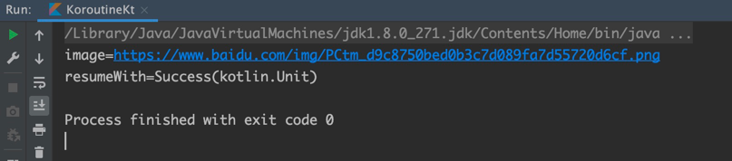

# 破解Kotlin协程创建调用的那些事

Kotlin协程从1.3正式版除出来也很久了，相比大家伙也比较熟悉了，从Android的AAC架构到后后端都可以见到它的身影，那么问题来了，用了那么久的协程体你知道它怎么创建的么。

一天我问同事：你知不知道协程是怎么创建的？

同事：我知道，是`launch`，`async`，`...`。

我：？？？？？

我：那如果抛开官方给的框架，就用Kotlin语言提供的最基本的API创建呢？

同事：？？？？，那你创个毛。

此时送人外号逼王的我，知道机会来了。于是乎就有了这个文章。

## 预备知识

首先，你需要知道协程是啥玩意，知道基本概念之后在来看（知道的话，当我没有说

## 好戏开场了

我们抛开官方的框架，只用语言最基本的API来洞悉Kotlin协程的内部设计。

为了接下来方便带领大家分析，我把用到的概念和API给贴出来，方便分析。

一般启动协程我们需要：

1、一个suspend fun

```kotlin
suspend fun foo() {}
```

2、一个启动协程的API：startCoroutine，如果不想要立即执行，则可用：createCoroutine

```kotlin
@SinceKotlin("1.3")
@Suppress("UNCHECKED_CAST")
public fun <T> (suspend () -> T).startCoroutine(
    completion: Continuation<T>
) {
    createCoroutineUnintercepted(completion).intercepted().resume(Unit)
}
```

```kotlin
@SinceKotlin("1.3")
@Suppress("UNCHECKED_CAST")
public fun <T> (suspend () -> T).createCoroutine(
    completion: Continuation<T>
): Continuation<Unit> =
    SafeContinuation(createCoroutineUnintercepted(completion).intercepted(), COROUTINE_SUSPENDED)

```

上面创建协程和启动协程中我们看到有一个非常关键的方法：```createCoroutineUnintercepted```方法实现如下（具体功能稍后在说：

```kotlin
@SinceKotlin("1.3")
public actual fun <T> (suspend () -> T).createCoroutineUnintercepted(
    completion: Continuation<T>
): Continuation<Unit> {
    val probeCompletion = probeCoroutineCreated(completion)
    return if (this is BaseContinuationImpl)
        create(probeCompletion)
    else
        createCoroutineFromSuspendFunction(probeCompletion) {
            (this as Function1<Continuation<T>, Any?>).invoke(it)
        }
}
```

3、协程执行完后需要一个 completion 来回调，即： Continuation

```kotlin
@SinceKotlin("1.3")
public interface Continuation<in T> {
    /**
     * The context of the coroutine that corresponds to this continuation.
     */
    public val context: CoroutineContext

    /**
     * Resumes the execution of the corresponding coroutine passing a successful or failed [result] as the
     * return value of the last suspension point.
     */
    public fun resumeWith(result: Result<T>)
}
```

4、BaseContinuationImpl

```kotlin
@SinceKotlin("1.3")
internal abstract class BaseContinuationImpl(
    // This is `public val` so that it is private on JVM and cannot be modified by untrusted code, yet
    // it has a public getter (since even untrusted code is allowed to inspect its call stack).
    public val completion: Continuation<Any?>?
) : Continuation<Any?>, CoroutineStackFrame, Serializable {
    // This implementation is final. This fact is used to unroll resumeWith recursion.
    public final override fun resumeWith(result: Result<Any?>) {
        // This loop unrolls recursion in current.resumeWith(param) to make saner and shorter stack traces on resume
        var current = this
        var param = result
        while (true) {
            // Invoke "resume" debug probe on every resumed continuation, so that a debugging library infrastructure
            // can precisely track what part of suspended callstack was already resumed
            probeCoroutineResumed(current)
            with(current) {
                val completion = completion!! // fail fast when trying to resume continuation without completion
                val outcome: Result<Any?> =
                    try {
                        val outcome = invokeSuspend(param)
                        if (outcome === COROUTINE_SUSPENDED) return
                        Result.success(outcome)
                    } catch (exception: Throwable) {
                        Result.failure(exception)
                    }
                releaseIntercepted() // this state machine instance is terminating
                if (completion is BaseContinuationImpl) {
                    // unrolling recursion via loop
                    current = completion
                    param = outcome
                } else {
                    // top-level completion reached -- invoke and return
                    completion.resumeWith(outcome)
                    return
                }
            }
        }
    }
}
```

5、ContinuationImpl

```kotlin
@SinceKotlin("1.3")
// State machines for named suspend functions extend from this class
internal abstract class ContinuationImpl(
    completion: Continuation<Any?>?,
    private val _context: CoroutineContext?
) : BaseContinuationImpl(completion) {
    constructor(completion: Continuation<Any?>?) : this(completion, completion?.context)

    public override val context: CoroutineContext
        get() = _context!!

    @Transient
    private var intercepted: Continuation<Any?>? = null

    public fun intercepted(): Continuation<Any?> =
        intercepted
            ?: (context[ContinuationInterceptor]?.interceptContinuation(this) ?: this)
                .also { intercepted = it }

    protected override fun releaseIntercepted() {
        val intercepted = intercepted
        if (intercepted != null && intercepted !== this) {
            context[ContinuationInterceptor]!!.releaseInterceptedContinuation(intercepted)
        }
        this.intercepted = CompletedContinuation // just in case
    }
}
```

6、SuspendLambda

```kotlin
@SinceKotlin("1.3")
// Suspension lambdas inherit from this class
internal abstract class SuspendLambda(
    public override val arity: Int,
    completion: Continuation<Any?>?
) : ContinuationImpl(completion), FunctionBase<Any?>, SuspendFunction {
    constructor(arity: Int) : this(arity, null)

    public override fun toString(): String =
        if (completion == null)
            Reflection.renderLambdaToString(this) // this is lambda
        else
            super.toString() // this is continuation
}
```

7、SuspendLambda的继承顺序为-> SuspendLambda:-> ContinuationImpl:-> BaseContinuationImpl

8、suspend ()-> Unit 会被编译器编译成一个匿名类 extends SuspendLambda implements Function1<P, R> 并且实现 invokeSuspend 和 create 两个抽象方法。

9、使用 suspend 修饰的函数编译器会自动添加一个Continuation。

### 中场开始

有了前面的理论，不上代码感觉总是怪怪的。

首先我们定义一个launch用来启动我们的代码：

代码有所改动，并不是前面所看到的```startCoroutine```里定义的那样，我做了个精简。 放心这样是完全可行的。

```kotlin
fun <T> launch(block: suspend () -> T) {
    val coroutine = block.createCoroutineUnintercepted(object : Continuation<T> {
        override val context: CoroutineContext
            get() = EmptyCoroutineContext

        override fun resumeWith(result: Result<T>) {
            println("result=$result")
        }
    })
    coroutine.resume(Unit)
}
```

接着是我们的suspend函数（这里并没有真正的挂起，因为没有切线程：

```kotlin
suspend fun loadImage() = suspendCoroutine<String> {
    it.resume("https://www.baidu.com/img/PCtm_d9c8750bed0b3c7d089fa7d55720d6cf.png")
}
```

看一下整体代码：

```kotlin
import kotlin.coroutines.*
import kotlin.coroutines.intrinsics.createCoroutineUnintercepted

fun main() {
    launch {
        val image = loadImage()
        println("image=$image")
    }
}

fun <T> launch(block: suspend () -> T) {
    val coroutine = block.createCoroutineUnintercepted(object : Continuation<T> {
        override val context: CoroutineContext
            get() = EmptyCoroutineContext

        override fun resumeWith(result: Result<T>) {
            println("resumeWith=$result")
        }
    })
    coroutine.resume(Unit)
}

suspend fun loadImage() = suspendCoroutine<String> {
    it.resume("https://www.baidu.com/img/PCtm_d9c8750bed0b3c7d089fa7d55720d6cf.png")
}
```

OK，都准备完了，那就运行把。biu~ biu~ 看结果：



结果很完美。不知道你们好不好奇协程怎么创建的，怎么调用到resumeWith的。有基础的同学可能知道编译器会给suspend fun 加一个Continuation，但具体是怎么调用这个 Continuation也不是很清楚。

好吧，本着我不入地狱谁入地狱，有了前面的基础和问题，我们一步一步来，剖开协程内部创建调用流程的那些事。

接下来我们把代码给反编译了，看看他真正庐山真面目：

```java
public final class KoroutineKt {
    public static final void main() {
        launch(new KoroutineKt$main$1(null));
    }

    static final class KoroutineKt$main$1 extends SuspendLambda implements Function1<Continuation<? super Unit>, Object> {
        int label;

        @Nullable
        public final Object invokeSuspend(@NotNull Object $result) {
            String image;
            Object object = IntrinsicsKt.getCOROUTINE_SUSPENDED();
            switch (this.label) {
                case 0:
                    this.label = 1;
                    if (KoroutineKt.loadImage((Continuation<? super String>) this) == object)
                        return object;
                    image = (String) KoroutineKt.loadImage((Continuation<? super String>) this);
                    System.out.println(image);
                    return Unit.INSTANCE;
                case 1:
                    System.out.println(image);
                    return Unit.INSTANCE;
            }
            throw new IllegalStateException("call to 'resume' before 'invoke' with coroutine");
        }

        KoroutineKt$main$1(Continuation param1Continuation) {
            super(1, param1Continuation);
        }

        @NotNull
        public final Continuation<Unit> create(@NotNull Continuation completion) {
            Intrinsics.checkNotNullParameter(completion, "completion");
            return (Continuation<Unit>) new KoroutineKt$main$1(completion);
        }

        public final Object invoke(Object param1Object) {
            return ((KoroutineKt$main$1) create((Continuation) param1Object)).invokeSuspend(Unit.INSTANCE);
        }
    }

    public static final <T> void launch(@NotNull Function1 block) {
        Continuation coroutine = IntrinsicsKt.createCoroutineUnintercepted(block, new KoroutineKt$launch$coroutine$1());
        Continuation intercepted = IntrinsicsKt.intercepted(coroutine);
        Continuation continuation1 = intercepted;
        Unit unit = Unit.INSTANCE;
        Result.Companion companion = Result.Companion;
        continuation1.resumeWith(Result.constructor - impl(unit));
    }

    public static final class KoroutineKt$launch$coroutine$1 implements Continuation<T> {
        @NotNull
        public CoroutineContext getContext() {
            return (CoroutineContext) EmptyCoroutineContext.INSTANCE;
        }

        public void resumeWith(@NotNull Object result) {
            String str = "result=" + Result.toString - impl(result);
            System.out.println(str);
        }
    }

    @Nullable
    public static final Object loadImage(@NotNull Continuation completion) {
        SafeContinuation safeContinuation = new SafeContinuation(IntrinsicsKt.intercepted($completion));
        Continuation continuation = (Continuation) safeContinuation;
        String str = "https://www.baidu.com/img/PCtm_d9c8750bed0b3c7d089fa7d55720d6cf.png";
        Result.Companion companion = Result.Companion;
        continuation.resumeWith(Result.constructor - impl(str));
        if (safeContinuation.getOrThrow() == IntrinsicsKt.getCOROUTINE_SUSPENDED())
            DebugProbesKt.probeCoroutineSuspended(completion);
        return safeContinuation.getOrThrow();
    }
}
```

为了保证原汁原味，代码我只删除了部分调试代码。

反编译后的代码，有两个匿名内部类。

```KoroutineKt$main$1``` 是我们的suspend () -> Unit，正如我前面所说的那样，他会被编译成一个匿名内部类 extends SuspendLambda implements Function1<
P1,R>。

```KoroutineKt$launch$coroutine$1``` 这个是我们的 completion 就是那个object: Continuation<T>的这个，不过我们不用太care它，知道他是我们suspend fun
最终会回调到这就行了。

首先我们看```launch()```方法。

```java
public static final<T> void launch(@NotNull Function1 block){
    Continuation coroutine=IntrinsicsKt.createCoroutineUnintercepted(block,new KoroutineKt\$launch\$coroutine\$1());
    Continuation intercepted=IntrinsicsKt.intercepted(coroutine);
    Continuation continuation1=intercepted;
    Unit unit=Unit.INSTANCE;
    Result.Companion companion=Result.Companion;
    continuation1.resumeWith(Result.constructor-impl(unit));
}
```

在```launch()```中最重要的一个方法就是```createCoroutineUnintercepted()```，他是我们创建协程最重要的一步。

在```main()```方法中，我们编译器自动给我们创建了一个 completion 为 null 的 KoroutineKt$main$1，
进入```launch()```内部，首先执行createCoroutineUnintercepted，在这里创建我们的在completion，然后把我们的block和completion给传给createCoroutineUnintercepted方法，
前面我已经知道了 createCoroutineUnintercepted 会判断自己是不是 BaseContinuationImpl 的实现类，如果是，则调用create方法，否则这直接调用Function.invoke。

是不是突然明白了什么？ 我们看一下KoroutineKt$main$1的create方法。

```java
@NotNull
public final Continuation<Unit> create(@NotNull Continuation completion) {
        Intrinsics.checkNotNullParameter(completion, "completion");
        return (Continuation<Unit>) new KoroutineKt\$main\$1(completion);
        }
```

```create()```方法把我们的completion给传入创建一个新的KoroutineKt$main$1，并返回了一个```Continuation<Unit>```，至此我们的协程已经创建完成了。

协程创建完了，是不是该启动了，于是continuation调用resumeWith(Unit)启动协程。

这里的 continuation 可是继承自 BaseContinuationImpl 的哎，于是乎进入到了 BaseContinuationImpl 的 resumeWith。

我们再看一下 BaseContinuationImpl 的 resumeWith 干了啥，上代码。

```kotlin
public final override fun resumeWith(result: Result<Any?>) {
    // This loop unrolls recursion in current.resumeWith(param) to make saner and shorter stack traces on resume
    var current = this
    var param = result
    while (true) {
        // Invoke "resume" debug probe on every resumed continuation, so that a debugging library infrastructure
        // can precisely track what part of suspended callstack was already resumed
        probeCoroutineResumed(current)
        with(current) {
            val completion = completion!! // fail fast when trying to resume continuation without completion
            val outcome: Result<Any?> =
                try {
                    val outcome = invokeSuspend(param)
                    if (outcome === COROUTINE_SUSPENDED) return
                    Result.success(outcome)
                } catch (exception: Throwable) {
                    Result.failure(exception)
                }
            releaseIntercepted() // this state machine instance is terminating
            if (completion is BaseContinuationImpl) {
                // unrolling recursion via loop
                current = completion
                param = outcome
            } else {
                // top-level completion reached -- invoke and return
                completion.resumeWith(outcome)
                return
            }
        }
    }
}
```

在 resumeWith 中，调用了```invokeSuspend()```，于是乎进入到我们写的block中。

```java
public final Object invokeSuspend(@NotNull Object \$result) {
        String image;
        Object object = IntrinsicsKt.getCOROUTINE_SUSPENDED();
        switch (this.label) {
        case 0:
        this.label = 1;
        if (KoroutineKt.loadImage((Continuation<? super String>) this) == object)
        return object;
        image = (String) KoroutineKt.loadImage((Continuation<? super String>) this);
        System.out.println(image);
        return Unit.INSTANCE;
        case 1:
        System.out.println(image);
        return Unit.INSTANCE;
        }
        throw new IllegalStateException("call to 'resume' before 'invoke' with coroutine");
        }
```

看到这，有没有觉得我们识破了庐山真面目了，为啥这样子说呢。

我觉得已经很明显了啊～

首先 我们知道 label 最开始为0 ，经过switch，进入了case 0，label=1，然后执行我们的loadImage，如果我们的loadImage是一个真正在网络请求图片方法（即：已经挂起，那么返回的一定是 COROUTINE_SUSPENDED。

根据上面的代码，我们知道，如果返回了COROUTINE_SUSPENDED，直接return invokeSuspend，接着在 BaseContinuationImpl 的 resumeWith 中 判断invokeSuspend 返回是不是 COROUTINE_SUSPENDED，
如果是则return 退出 while 结束循环，如果不是则拿到数据，组成Result，调用我们的 completion 把结果返回，我们的协程也就结束了。

到这，可能有人会问了，你这都return怎么做的挂起呢？

还记得最开始我说的如果函数用了suspend修饰编译器自动会加一个 Continuation 么，我们的 loadImage 就是 suspend 修饰的编译器当然会给它生成一个 continuation 的参数啊，在switch case 0 中，我们已经把``自己``传给 loadImage 了啊，等到 loadImage 拿到数据后，调用我们的
continuation.resumeWith，别忘了我们的 continuation 可是 BaseContinuationImpl，调用resumeWith，之后肯定又会执行 invokeSuspend，进入 switch 分支，只不过，在执行loadImage之前，我们 label 已经为 1，switch 会进入 case 1 ，这个时候我们已经有image数据了，然后调用println输出数据。

好了，到这里我们的协程的创建和调用就差不多就弄的清清楚楚了。

### 完美落幕

我们总结一下吧：

协程的创建：

1、首先new 一个 没有 completion 的 SuspendLambda，实现了 invokeSuspend 和 create两个抽象方法。

2、在创建协程的时候，用我们的 completion 调用最开始创建的 SuspendLambda的create方法，new一个带有completion的SuspendLambda，返回一个``Continuation<Unit>``。

3、调用resumeWith(Unit)启动协程。

协程的挂起与恢复：

1、协程挂起标志 COROUTINE_SUSPENDED，退出 while 。

2、结果返回后调用resumeWith继续协程。
